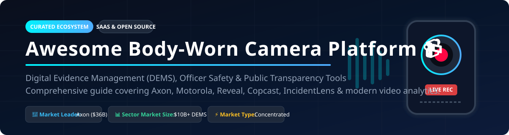

# Awesome Body-Worn Camera Platform 📹

  

  
  
  
  

---

## 💡 Overview & Industry Insights 🔍

A curated list of **Body-Worn Camera (BWC) platforms**, **Digital Evidence Management Systems (DEMS)**, **in-car video systems**, and **open-source law enforcement technology**. Essential resources for public safety Technologists, police departments, municipal agencies, security firms, and AI video analytics developers.

> [!IMPORTANT]
> **Market Size & Structure**: The global Body-Worn Camera and Digital Evidence Management System (DEMS) market is estimated at **$1.4 Billion to $10.5 Billion** (including ecosystem cloud storage, AI redaction, and in-car integration) growing at a **CAGR of ~16.5%**. The market structure is **highly concentrated** (a "winner-take-most" market) dominated heavily by **Axon Enterprise**, alongside key security conglomerates like Motorola Solutions.

---

## 🏢 SaaS & Hosted Commercial Platforms 🌐

> The market is dominated by hardware-plus-cloud software subscription bundles with multi-year government agency contracts.

| Product Name 🚀 | Enterprise Valuation / Revenue 💰 | Starting Pricing Tier 💵 | Free Tier Limit / Trial Plan 🎁 | Key Features & Focus 🌟 |
| :--- | :--- | :--- | :--- | :--- |
| **[Axon Body](https://www.axon.com/)** | **$36.0B Valuation** ($2.8B Rev) | **~$79 - $107/mo** per user (TAP bundle) | **No Free Tier** (14-day agency demo on request) | Market leader, Evidence.com cloud storage, AI Auto-Transcribe, TASER integration. |
| **[Motorola V700](https://www.motorolasolutions.com/)** | **$124.0B Valuation** ($10.8B Rev) | **~$65 - $95/mo** per user (CommandCentral) | **No Free Tier** (30-day agency evaluation units) | LTE live streaming, Peer-Assisted Recording (PAR), CommandCentral DEMS. |
| **[Panasonic Arbitrator](https://www.panasonic.com/)** | **$23.5B Valuation** ($55.0B Rev) | **~$50 - $75/mo** per user (Software license) | **No Free Tier** (Custom pilot programs) | Arbitrator BWC4000, 12h runtime, H.265 compression, 6-axis stabilization. |
| **[Getac Video](https://www.getac.com/)** | **$2.2B Valuation** ($1.1B Rev) | **~$45 - $70/mo** per user | **No Free Tier** (Agency trial program on request) | BC-04 4K camera, OLED display, Veritone AI redaction workflow. |
| **[Digital Ally](https://www.digitalallyinc.com/)** | **$12.5M Valuation** ($28.0M Rev) | **~$35 - $60/mo** per user | **No Free Tier** (30-day trial for qualified departments) | FirstVu Pro 1080p, AWS GovCloud DEMS, 120s pre-event recording. |
| **[Reveal D-Series](https://www.revealmedia.com/)** | **~$150.0M Est. Valuation** | **~$40 - $65/mo** per device | **No Free Tier** (14-day evaluation kit) | Articulated camera head, front-facing screen display, AES-256 encryption. |
| **[Utility BodyWorn](https://www.utility.com/)** | **~$120.0M Est. Valuation** | **~$50 - $80/mo** per user | **No Free Tier** (Pilot project agreement required) | Policy-based automatic recording, gunshot detection (ASRT), Smart Redaction. |
| **[Safe Fleet FOCUS](https://www.safefleet.net/)** | **~$100.0M Est. Valuation** | **~$40 - $60/mo** per user | **No Free Tier** (Department demo evaluation) | FOCUS X3 LTE, 14h battery life, Focus Ecosystem integration. |
| **[PRO-VISION Bodycam 4](https://provisionusa.com/)** | **~$45.0M Est. Valuation** | **~$30 - $50/mo** per user | **No Free Tier** (Agency trial units provided) | Vehicle lightbar auto-activation, RFID login, 140° wide lens. |
| **[Veho MUVI](https://www.veho.com/)** | **~$30.0M Est. Valuation** | **~$25/mo** (or $299 one-time hardware) | **No Free Tier** (Standard 30-day consumer return policy) | MUVI HD Pro 3 Titan, standalone 15-hour recording, night vision. |

---

## 🔓 Open-Source GitHub Projects 💻

Self-hosted software, Android camera ports, and AI video analytics pipelines for law enforcement evidence handling and research.

| Repo & Star Badge 🌟 | Stars ⭐ | Primary Focus & Stack 🛠️ | Description 📝 |
| :--- | :---: | :--- | :--- |
| **[igarape/copcast](https://github.com/igarape/copcast/stargazers)** |  | Android, Node.js, WebRTC | Turns commodity Android smartphones into body-worn cameras with live video streaming and cloud management. Deployed in Brazil & South Africa. |
| **[OxWearables/capture24](https://github.com/OxWearables/capture24/stargazers)** |  | Python, Machine Learning | Oxford University dataset and processing toolkit for body-worn activity trackers and wearable visual logging. |
| **[RCPisAwesome/FiveMRCPAxonCamera](https://github.com/RCPisAwesome/FiveMRCPAxonCamera/stargazers)** |  | Lua, FiveM SDK | Simulated Axon Body Camera HUD overlay and recording simulation for GTA V police roleplay modules. |
| **[geoporttishare/point_cloud_to_dem](https://github.com/geoporttishare/point_cloud_to_dem/stargazers)** |  | C++, Geospatial | Utilities for generating high-resolution digital elevation surfaces and 3D environment spatial mapping from point cloud data. |
| **[rukaiya2000/incident-lens](https://github.com/rukaiya2000/incident-lens/stargazers)** |  | Python, Neo4j, OpenAI, Strands | Converts multi-source bodycam and dashcam video into a Neo4j knowledge graph with AI timecode video citations. |
| **[Hrishikesh332/tl-compliance-intelligence](https://github.com/Hrishikesh332/tl-compliance-intelligence/stargazers)** |  | Python, AWS Bedrock, TwelveLabs | Automated video indexing, multimodal search embeddings, and risk/compliance analysis across law enforcement bodycams. |
| **[KaraZajac/Axon_ON](https://github.com/KaraZajac/Axon_ON/stargazers)** |  | C, Flipper Zero App | Flipper Zero application designed to trigger recording commands on Axon body cameras over Bluetooth LE. |

---

## 🤝 How to Contribute 🛠️

1. **Fork** this repository.
2. Add your SaaS or Open-Source project to `README.md` following the tabular format.
3. Ensure pricing, valuation, star count, and links are accurately stated.
4. Submit a **Pull Request**!

For details on general awesome lists, visit [Awesome Awesome Awesome](https://github.com/ishandutta2007/Awesome-Awesome-Awesome).

---

## 💖 Support & Sponsorship ☕

If you find this repository helpful in researching body-worn camera solutions, digital evidence software, or open-source public safety tech, please consider supporting the project!

- ⭐ **Star** this repository to increase its visibility.
- 🔀 **Fork** and share with public safety technologists.
- ☕ **Buy Me a Coffee**: Sponsor the project via [GitHub Sponsors Dashboard](https://github.com/sponsors/ishandutta2007).

---

## 📈 Star History 📊

---

## ⚠️ Disclaimer 📜

- This list is **community-curated** and provided for informational purposes only.
- Body-worn camera deployment requires compliance with federal, state, and local privacy laws, public record disclosure rules, and chain of custody validation.
